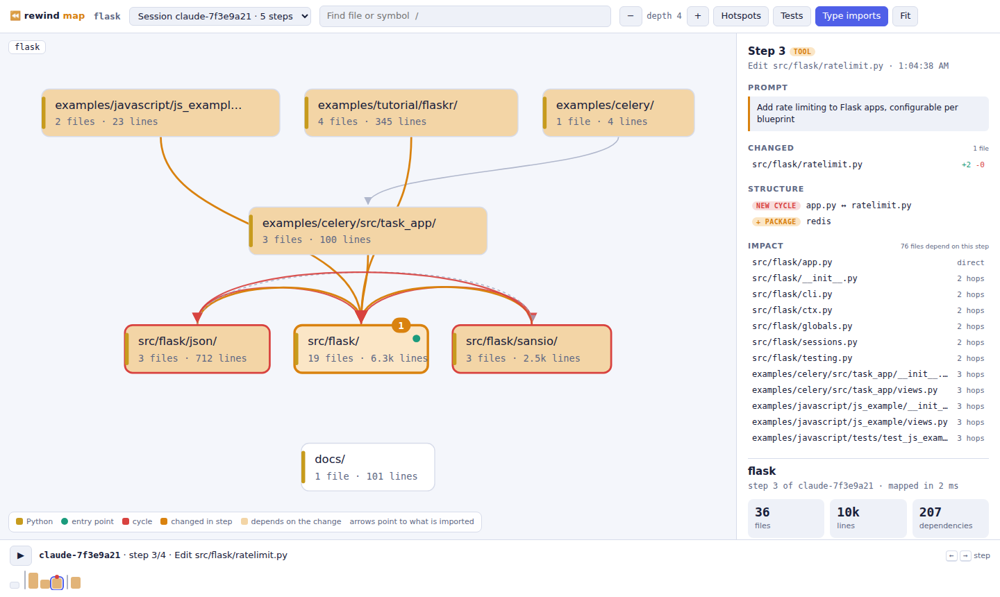
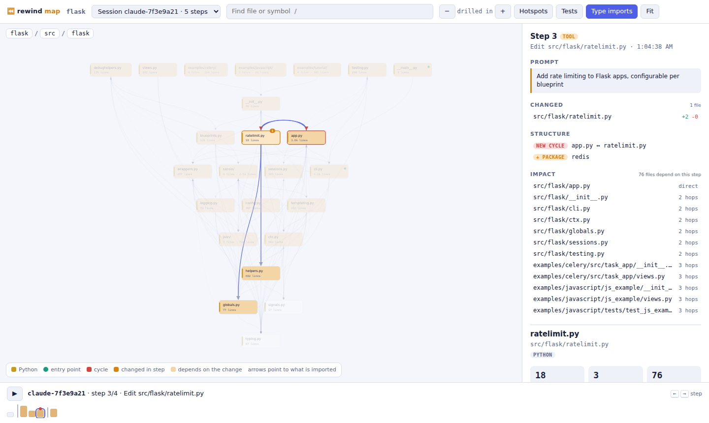

# ⏪ Rewind

**Undo history and a code map for AI coding agents.** Rewind records every step an agent takes as a Git snapshot. You can see what changed at each step, which prompt caused it, and put your files back to any earlier step. Then open a live map of your codebase and replay the session on it: what the agent touched, what depends on it, and where it added a dependency or an import cycle.



```
$ rewind log
Session claude-1a2b3c4d  4 steps · started Oct 4 15:30

     0  15:30:36  start    baseline                session started
  ▸ Add a greeting and a helper package
     1  15:31:02  tool     +3 -1 1 file            Edit src/main.go
     2  15:31:40  tool     +1 -0 1 file            Write src/util/util.go
  ▸ Actually delete the helper and rename main.go
     3  15:33:15  tool     +5 -6 3 files           Bash: rm -rf src/util && mv src/main.go src/app.go

$ rewind restore 2
  write         src/main.go
  write         src/util/util.go
  delete        src/app.go

Restored step 2. The state before the restore is saved too, so `rewind log` shows how to undo this.
```

## Why

Agents edit dozens of files in one session. When step 14 of 30 goes wrong, `git` doesn't help much: the agent didn't commit, and `git stash` or `checkout` throws away the good steps along with the bad one. Rewind keeps a snapshot of **every** step, so you can go back to exactly the last one that worked.

## Install

```sh
go install github.com/8unionn-creator/cool_projects404/rewind/cmd/rewind@latest
```

## Record your agent

```sh
cd your-repo
rewind init claude     # or codex, gemini, cursor, or all
```

| Agent | Hook file | What gets recorded |
|---|---|---|
| **Claude Code** | `.claude/settings.local.json` | session start, each prompt, each Edit/Write/Bash |
| **OpenAI Codex CLI** | `.codex/hooks.json` | session start, each prompt, each tool call (`apply_patch` file names are read from the patch). Approve the new hooks once with `/hooks`. |
| **Gemini CLI** | `.gemini/settings.json` | `SessionStart`, `BeforeAgent` (the prompt), `AfterTool` |
| **Cursor** | `.cursor/hooks.json` | `beforeSubmitPrompt`, `afterFileEdit`, `afterShellExecution`, `stop`. Restart Cursor once afterwards. |
| **Anything else** (Aider, Copilot, Windsurf, edits by hand) | none | `rewind watch` snapshots whenever files change and then settle for 2 seconds |

Tool calls that don't change any file, such as reads, searches or `ls`, add no step. If an agent can't see `rewind` on its PATH (common for apps launched from a dock or Start menu), run `rewind init <agent> --absolute` to register the binary by its full path.

## VS Code extension

[`editors/vscode`](editors/vscode/) opens the code map in an editor tab. It also lets you browse a session's steps (view a diff or restore any step), set up recording for any agent, and start `rewind watch`, all from the command palette. The status bar shows the current session and step.

```sh
cd editors/vscode && npx @vscode/vsce package   # builds rewind-0.3.0.vsix
code --install-extension rewind-0.3.0.vsix
```

## Commands

| Command | What it does |
|---|---|
| `rewind log` | Steps of the current session, grouped by prompt |
| `rewind show 7 -p` | What step 7 changed, why, and the full patch |
| `rewind diff 3 9` | Everything that changed between step 3 and step 9 |
| `rewind diff -w 5` | What changed since step 5, compared with your files now |
| `rewind restore -n 5` | Preview a restore without touching anything |
| `rewind restore 5` | Put the files back as they were at step 5 |
| `rewind sessions` | All recorded sessions |
| `rewind watch` | Record steps for any tool by watching files |
| `rewind start` / `rewind snap -m "…"` | Record by hand, without an agent |

Steps are numbers in the current session (`7`), `last`, or `session:number` for another session.

## The code map

```sh
rewind map            # opens http://127.0.0.1:<port>/ in your browser
```

A single binary with an embedded viewer. It runs offline on localhost and loads nothing from the internet.

- **Architecture at a glance.** Folders are laid out top-down by dependency: the code that imports others sits above the code it imports, so entry points end up at the top and foundations at the bottom. Click a box to see its files and its dependencies in both directions, double-click to drill into it, and use the breadcrumbs to come back out.
- **Every file explained.** See what a file defines, what it imports, what imports it, its third-party packages and its source, with search across files and symbols (press `/`).
- **Who calls this function.** Click any function or method to see every place that calls it and everything it calls, with its whole body highlighted in the source view. Calls are resolved through imports, modules, same-package code, `self`/`this` and Go receiver types. A call on a variable whose type isn't known (`order.save()`) is linked only when exactly one visible method has that name, and it's labelled *likely*.
- **Impact.** "Show impact" lights up every file that depends on the selected one, directly or transitively. That's the list of what to re-test.
- **Cycles.** Import cycles between files and between folders are drawn in red. Imports that never run at load time are left out: TypeScript `import type`, Python `if TYPE_CHECKING:` and imports inside a function.
- **Hotspots.** Files ranked by commits in the last year × complexity, which is where bugs cluster.
- **Diff and restore in the browser.** "View changes" shows a step's code changes, unified or side by side. "Compare with now" diffs a step against your current files. "Restore this step…" lists every file that will be rewritten or deleted and waits for you to confirm. Your current state is saved as a step first, so a restore can always be undone.
- **Session replay.** Pick a session and scrub its timeline (or press ▶). Each step shows its prompt, the files it changed, the folders that depend on them, and **structural changes**: new dependencies between folders, new third-party packages, new import cycles. While an agent is working, new steps appear on their own.



### From the terminal

| Command | What it does |
|---|---|
| `rewind deps src/app.py` | What a file imports, what imports it, and what it defines |
| `rewind impact src/db.go` | Every file that depends on it, grouped by distance |
| `rewind impact --step 7` | Everything that depends on what step 7 changed |
| `rewind callers src/db.go Open` | Who calls a function, and what it calls |
| `rewind cycles --fail` | List import cycles; exits 1 if there are any, for CI |
| `rewind map --json` / `--dot` | The dependency graph as JSON, or folders as Graphviz |
| `rewind show 7` | Now also reports how the step changed the structure |

`map`, `deps` and `cycles` take `--at <step|revision>`, for example `--at HEAD`, `--at 7` or `--at main~10`.

### Language support

| Language | Resolves |
|---|---|
| **Go** | packages across nested `go.mod` modules (parsed with the standard library's `go/parser`); links to the exact file that defines each `pkg.Name` used, and files within a package by the names they share |
| **Python** | absolute and relative imports, `src/` layouts, packages in subfolders, sibling scripts; `if TYPE_CHECKING:` and function-local imports count as lazy |
| **TypeScript / JavaScript** | relative paths and extensions (`.js` → `.ts`), `index` files, `tsconfig` `paths`/`baseUrl`, monorepo packages by name (including `exports`, and `dist/` mapped back to `src/`), `#subpath` imports, `require()` and `import()` |
| **Java / Kotlin** | `package` and `import` (including `*` and `static`), same-package classes by name, mixed Java and Kotlin, Kotlin top-level functions and properties |
| **C#** | `namespace` (block or file-scoped), `using` (including aliases, `static` and project-wide `global using`), types referenced from visible namespaces |
| **C / C++** | `#include "…"` relative to the file, then by path suffix like an include path would; `<…>` headers from the repo; out-of-class definitions like `Engine::run` |
| **Rust** | `mod` declarations, `use` trees (`crate::`, `self::`, `super::`, `{a, b::c}`), workspace crates by name, external crates |
| **PHP** | `namespace` and `use` (including group `use A\{B, C}`), Composer PSR-4 autoloading, trait `use`, `require`/`include` |
| **Ruby** | `require` and `require_relative` with `lib/`, `spec/` and `test/` on the load path; constants for Rails/Zeitwerk autoloading |
| **Dart** | `import`/`export`/`part` with `package:` URIs mapped through `pubspec.yaml`, relative imports |

The parsers are deliberately small and dependency-free, so `rewind` stays a single static binary with no cgo. They skip strings and comments correctly, including raw strings, char literals and Rust lifetimes. The call graph doesn't do full type inference, so calls through interfaces, callbacks and dynamic dispatch can be missed or marked *likely*.

**Cycles** are only reported where they can actually break something. File-level import cycles are reported in Python and JS/TS (import order) and C/C++ (include order). Folder-level cycles are reported in every language except Rust, which allows any cycle inside a crate, while Cargo forbids them between crates. In the map, the arrows that close each loop are drawn in red.

Tested on real projects, each mapped in under 160 ms:

| Language | Project | Files | Time |
|---|---|---|---|
| Python | Flask | 83 | 74 ms |
| TypeScript | Vite | 1,549 | 234 ms |
| Go | Hugo | 936 | 298 ms |
| Java | Spring PetClinic | 50 | 44 ms |
| Kotlin | Okio | 357 | 139 ms |
| C# | CleanArchitecture | 152 | 43 ms |
| C | jq | 55 | 101 ms |
| C++ | fmt | 79 | 153 ms |
| Rust | ripgrep | 111 | 101 ms |
| PHP | Monolog | 228 | 82 ms |
| Ruby | Sinatra | 147 | 70 ms |
| Dart | dart-lang/http | 367 | 104 ms |

## How it works

Every snapshot is an ordinary Git commit on its own ref, `refs/rewind/<session>`, so the whole history can be read with plain `git`:

```sh
git log --oneline refs/rewind/claude-1a2b3c4d
```

- **Your Git state is never touched.** Snapshots are built with a private, temporary index file (`GIT_INDEX_FILE`) seeded from yours. Your branch, HEAD, staged changes and stash are left exactly as they were.
- **Everything that matters is captured.** That means tracked and untracked files, while `.gitignore` is respected, so `node_modules/` and build output are skipped.
- **It's cheap.** Git stores each file's content once, so 100 steps that each change one file cost roughly 100 small blobs.
- **Restoring is safe and can be undone.** Before a restore, the current state is saved as a step. A restore only rewrites files that differ, and never touches ignored files.
- **Safe with hooks that fire close together.** Writers take a lock, and each ref update is compare-and-swap on the previous step, so a session can never fork or skip a number.
- **Never blocks the agent.** If recording fails, the hook logs to `.git/rewind/hook.log` and exits successfully.

Step metadata (kind, tool, prompt) is stored as one JSON line at the end of each commit message.

The code map reads snapshots straight from Git's object database (`git ls-tree` plus one long-running `git cat-file --batch`), so any step can be analysed without checking it out. Parsed files are cached by blob ID. Consecutive steps share almost all of their blobs, so comparing step 6 with step 7 only re-parses the files that changed.

The viewer's server only binds to loopback addresses and refuses requests whose `Host` isn't local, which blocks DNS-rebinding attacks from other websites. It only serves files that are part of the map. The one action that changes files, restore, also needs a random token that is created each time the server starts. The token can only be read by the viewer page itself, and requests from any other `Origin` are rejected.

## Roadmap

- [x] **Stage 1:** snapshots, log, show, diff, restore, Claude Code hooks
- [x] **Stage 2:** code map for Go, Python and TypeScript/JavaScript: architecture view, drill-down, search, impact, cycles, hotspots
- [x] **Stage 3:** session replay on the map, with structural diffs per step and live updates
- [x] **Stage 4:** diff and restore in the map, 8 more languages, the call graph, hooks for Codex, Gemini CLI and Cursor, `rewind watch`, and a VS Code extension
- [ ] **Stage 5:** AI explanations of files, folders and steps, and a guided tour of a codebase

## Development

```sh
go test -race ./...
```

Tests create throwaway Git repositories and check results against stock `git`, including `git fsck` on every object Rewind writes.
